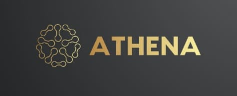

  
&nbsp;

   

[Main Paper](https://arxiv.org/abs/2312.01479) |

## Introduction

### Athena - a windows based Voice-Cloning System

As we detailed in based on the [main base paper](https://arxiv.org/abs/2312.01479) and [website](https://research.myshell.ai/), the advantages of athena are three-fold with the advantage of TTS:

**1. Accurate Tone Color Cloning.**
it tries to accurately clone the reference tone color and generate speech in multiple languages and accents.

**2. Flexible Voice Style Control.
**Athena enables granular control over voice styles, such as emotion and accent, as well as other style parameters including rhythm, pauses, and intonation. 

**3. Zero-shot Cross-lingual Voice Cloning.**
Neither of the language of the generated speech nor the language of the reference speech needs to be presented in the massive-speaker multi-lingual training dataset.

**4. Better Audio Quality.**
Athena adopts a different training strategy that delivers better audio quality, based on VITS.

**5 Native Multi-lingual Support.**
English, Spanish, French, Chinese, Japanese and Korean are natively supported in our project.

**6. FOSS.**
For exploring the field of voice coloning we have made it open-sourced.

## Main Contributors

- [Ojaswi Kumar Mishra - Key Developer ](https://www.linkedin/in/0xojaswi) at KEC.
- [Shalu Singh]  at Krishna Engineering College
- [Pulkit Kumar] at Krishna Engineering College

## How to Use
Please see [usage](docs/USAGE.md) for detailed instructions.

## Common Issues

Please see [QA](docs/QA.md) for common questions and answers. We will regularly update the question and answer list.

## License
This project is licensed under Academic Free License v3.0	AFL-3.0

## Acknowledgements
This implementation is based on several excellent projects, [TTS](https://github.com/coqui-ai/TTS), [VITS](https://github.com/jaywalnut310/vits), and [VITS2](https://github.com/daniilrobnikov/vits2). Thanks for their awesome work!
